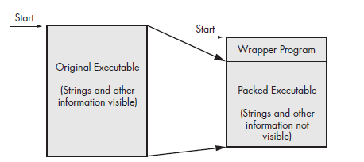

# 
Part 1 Summary: Basic Analysis

# Outline
+ [[#Chapter 1 Basic Static Techniques]]
+ [[#Chapter 2 Malware Analysis in Virtual Machines]]
## Chapter 1: Basic Static Techniques

&#8594; Use AV solutions to get an insight or a clue, as other people may have investigated your suspected executable.

&#8594; Use *hashing* to uniquely identify samples or "label" them.

&#8594; Search through the *strings* of a program to get an idea of what the executable does
>**Note**: Strings are either stored in ASCII or Unicode, ASCII is stored 1 byte at a time while Unicode is stored in 2 bytes, each with a null terminator (0x00)

&#8594; Packing and Obfuscation makes analysis more difficult.

Obfuscation &#8594; Hiding what the author wants to be executed.

Packing &#8594; A way of obfuscation by executing a wrapper before executing the main executable.

> **Note**: A wrapper is like the "frontier" of the program so it would thwart PE Viewers Legitimate programs have many strings contained within them, so if the program has little to no strings then this could be an indicator.

When packed programs are run, the wrapper is first run to decompress the actual executable.

**We can detect packers by using PEiD.**

&#8594; PE (Portable Executable) is used by Windows Executables, object codes or DLLs. They begin with a header that gives very valuable information such as import information or space requirements, etc..

&#8594; Imports are functions used in one program but are stored in a different program This connection is known by **Linking**, we can find in the PE header how functions are linked.

- There are three types of linking:
  - Static Linking
  - Dynamic Linking
  - Runtime Linking

### Static Linking

---
All code form the library is copied directly into the executable, thus the executable itself grows in size.

It is difficult to differentiate between statically linked code and the executable's own code (As the statically linked code is now part of the executable itself), The PE headers do not provide explicit information on statically linked code.

### Runtime Linking

---
This is commonly used in malware, the executable connects to the libraries **only** when the function is needed at runtime (This can cause runtime errors if the function call is not successful), There are functions that allow this functionally such as `GetProcAddress()`, `LoadLibrary()`, `LdrGetProcAddress()`, `LdrLoadDLL()` &#8594; These are used to access any function in any library.

### Dynamic Linking

---
Most common type of linking: When libraries are dynamically linked, they are loaded when the program is **initially** loaded, much like how DLLs are mapped into the executable during load.

When these functions are called, they execute **within** the library itself.

---

### PE Headers

The PE header stores information about every library that will be loaded and every function that will be used, this allows us to guess the malware's functionality.

- We can explore these functions by using **Dependency Walker**.
- Note: We can import functions by their "ordinal number" in the DLL export table.
  - Ordinal numbers are just "positions" that are statically predefined in the DLL export table 

---

### DLLs and EXEs

DLLs and EXEs can export functions but DLLs *implements* functions that can be exported to an exectuable.

- Programmers can also change of the exported function to the executable itself, which can cause confusion.

>Note: Functions are executed by their **address**.

- We can view these export information by **Dependency Walker**.

---

### PE File Headers and Sections

`.text` &#8594; It contains CPU instructions, it is the only section that executes and it should contain code.
`.rdata` &#8594; It contains import and export data, read-only data.
>Note: This section can contain `.idata` for imports and `.edata` for exports.

`.data` &#8594; It contains global data such as global variables.
`.rsrc` &#8594; It contains resources needed by executables, such as icons or even other executables' binaries.
`.pdata` &#8594; This section is present only in 64-bit systems, contains exception handling data.
`.reloc` &#8594; It contains information about relocation of binaries.
> Note: June 19, 1992 is the default compile time for [Delphi Programs](https://en.wikipedia.org/wiki/Delphi_(software)#:~:text=Delphi%20is%20a%20general%2Dpurpose,currently%20developed%20and%20maintained%20by).

- Virtual Size is how much space allocated during loading.
- Size of Raw Data shows the space of the section on the disk.
These values must be either equal or be slightly different, if the `.text` section on memory is less than its size on disk or vice versa &#8594; This is often indicative of packing (entropy).
We can view resources (`.rsrc` section) with **Resource Hacker**.

---

## Chapter 2: Malware Analysis in Virtual Machines

